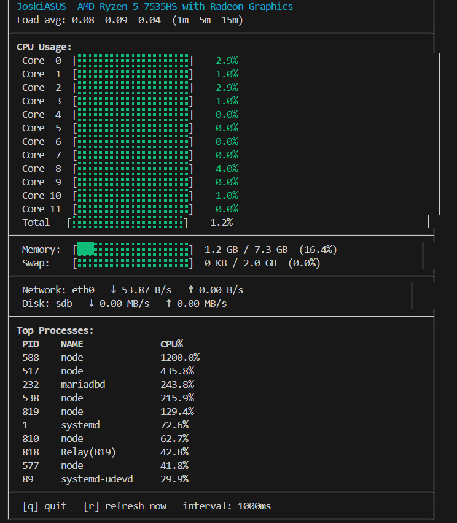

# syspeek

A multithreaded Linux system monitor for the terminal, written in C++17.
Reads live metrics directly from `/proc` and `/sys`, processes them in a
background collector thread, and renders an auto-refreshing UI in the
main thread using raw ANSI escape codes.



---

## Features

- Per-core CPU usage with color-coded progress bars and sparkline history
- Total CPU usage bar
- RAM and swap usage with percentages
- Network I/O in bytes/sec (auto-detects primary interface)
- Disk I/O in MB/s (auto-detects primary device)
- Load averages (1m / 5m / 15m)
- Top 10 processes by CPU usage
- System uptime and hostname
- Configurable refresh rate
- Zero external dependencies beyond the C++ standard library

---

## Architecture

Main Thread                        Collector Thread
│                                    │
│   ←── shared_data (mutex) ──→      │
│                                    │
Render UI                         Read /proc/stat
(ANSI codes)                      Read /proc/meminfo
every N ms                        Read /proc/net/dev
Read /proc/diskstats
Read /proc/[pid]/stat
Sleep(refresh_ms)

Two threads run concurrently, communicating through a `SystemData` struct
protected by a `std::mutex`:

- **Collector thread** — reads all `/proc` sources on a configurable
  interval, computes CPU and disk deltas between readings, sorts the
  process list, and writes results into `shared_data`.
- **Main thread** — acquires the mutex, copies `shared_data`, releases
  the mutex immediately, then renders the copied snapshot to the
  terminal. Holds the lock for the minimum time possible.

This is a deliberate producer/consumer pattern with mutex synchronization.
The lock is never held during rendering or sleeping, so the two threads
run as independently as possible.

### Why ANSI escape codes instead of ncurses

ncurses is the conventional choice for terminal UIs but adds a build
dependency and abstracts away the underlying mechanism. Using raw ANSI
codes directly (`\033[2J` to clear, `\033[row;colH` to position the
cursor, `\033[32m` for green etc.) keeps the project dependency-free and
demonstrates direct knowledge of how terminal control actually works.
The tradeoff is that we handle width calculations and Unicode manually,
which is why the sparkline padding explicitly accounts for multi-byte
UTF-8 characters.

---

## What is /proc?

`/proc` is a virtual filesystem exposed by the Linux kernel. It contains
no real files — reading from it causes the kernel to generate the data
on the fly. This means:

- `/proc/stat` — CPU tick counters updated every kernel tick (~10ms)
- `/proc/meminfo` — memory accounting in kilobytes
- `/proc/net/dev` — cumulative network byte counters per interface
- `/proc/diskstats` — cumulative sector read/write counters per device
- `/proc/[pid]/stat` — per-process CPU time and state
- `/proc/uptime` — seconds since boot
- `/proc/loadavg` — 1/5/15-minute exponential moving averages
- `/proc/cpuinfo` — static CPU model information

CPU and disk/network usage cannot be read as a single snapshot. They
require two readings with a time delta:
usage% = (active_ticks_2 - active_ticks_1) / (total_ticks_2 - total_ticks_1) * 100
syspeek takes an initial snapshot on startup and computes all subsequent
deltas against the previous reading each cycle.

---

## Build

Requires Linux (Ubuntu 22.04+), g++ 11+, cmake 3.16+.
```bash
cmake -B build -DCMAKE_BUILD_TYPE=Release
cmake --build build --parallel
```

Run tests:
```bash
cd build && ctest --output-on-failure
```

---

## Usage
```bash
./build/system-monitor [OPTIONS]

Options:
  --refresh N     Refresh interval in milliseconds (default: 1000)
  --no-color      Disable ANSI color output
  --bar-width N   Progress bar width in characters (default: 20)
  --iface NAME    Network interface to monitor (e.g. eth0)
  --disk NAME     Disk device to monitor (e.g. sda)
  --version       Print version and exit
  --help          Show this help message
```

### Config file

A default config file is written to `~/.config/system-monitor/config`
on first run. Edit it to set persistent defaults:
refresh_ms=1000
use_color=true
bar_width=20
sparkline_len=20
network_iface=eth0
disk_device=sda
Command-line flags always override the config file.

---

## Keyboard controls

| Key | Action |
|-----|--------|
| `q` | Quit cleanly |
| `r` | Force immediate refresh |
| `Ctrl+C` | Quit cleanly (SIGINT handled) |

---

## Color coding

| Color | CPU / memory usage |
|-------|--------------------|
| Green  | 0 – 49% |
| Yellow | 50 – 79% |
| Red    | 80 – 100% |